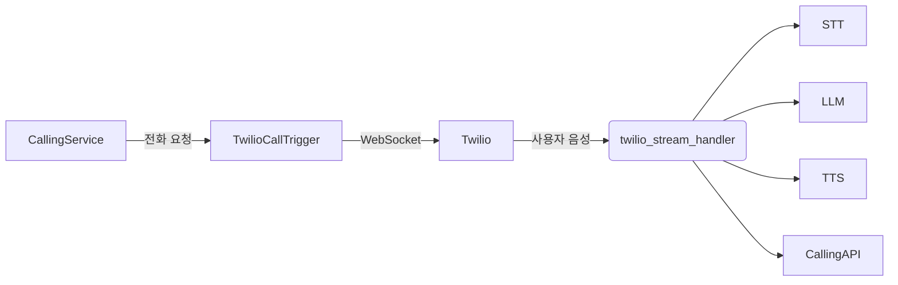

# 📞 AI Voice Call Orchestrator (Capstone Design Project)

> Twilio + WebSocket + STT + LLM + TTS + Summary + Result API

---

## 🧠 프로젝트 설명

이 프로젝트는 전화 기반으로 실시간 상담을 진행하고, 
사용자의 음성을 텍스트로 전환(STT), LLM을 통해 응답 생성, 
응답을 음성으로 변환(TTS)하여 다시 사용자에게 들려주는 **AI 음성 상담 시스템**입니다.

---

## 📂 주요 구성도



---

## ⚙️ 설치 방법

```bash
# 1. 프로젝트 설치
pip install -r requirements.txt

# 2. Whisper 모델 (STT) 및 Transformers 설치
pip install openai-whisper transformers torch

# 3. .env 설정
cp .env.example .env
vi .env
```

---

## 📁 주요 폴더 구조

```
CapstonDesign_CodeLearning/
├── calling_orchestrator/
│   ├── Service/            # 주요 서비스 모듈들
│   │   ├── stt_service.py
│   │   ├── tts_service.py
│   │   ├── llm_orchestrator.py
│   │   ├── summary_service.py
│   │   ├── calling_api.py
│   │   ├── twilio_call_trigger.py
│   │   ├── twilio_stream_handler.py
│   │   └── twilio_handler.py
│   └── main.py             # 시스템 전체 실행 진입점
│
├── grpc_proto/             # gRPC용 proto 파일 및 컴파일 결과
├── grpc_server/            # STT/TTS 서버
├── .env.example            # 환경변수 템플릿
└── README.md
```

---

## 🚀 실행 방법

```bash
# 1. gRPC 서버 실행 (각각 다른 터미널에서)
python grpc_server/stt_server.py
python grpc_server/tts_server.py

# 2. 메인 서버 실행 (FastAPI + WebSocket 동시)
python calling_orchestrator/main.py

# 3. 전화 걸기 (사전 등록된 수신자 번호 필요)
python calling_orchestrator/Service/twilio_call_trigger.py
```

---

## 📦 주요 환경 변수 (.env)

```env
TWILIO_ACCOUNT_SID=your_sid
TWILIO_AUTH_TOKEN=your_token
TWILIO_PHONE_NUMBER=+1xxxxxxx
CALLING_SERVICE_URL=http://localhost:8000/api/call_result
```

---

## 🧪 테스트용 CLI/Client 제공 예정
- `test_client.py` 를 통해 WebSocket 시뮬레이션 예정
- STT/TTS 단독 테스트도 모듈 단위로 가능

---

## ✍️ 기여자 / 관리
- 담당자: (이름)
- 학교/팀: (캡스톤 팀명)
- GitHub: (선택 사항)

---

## ✅ TODO
- [ ] test_client.py 작성
- [ ] STT 성능 튜닝
- [ ] UI 연동 또는 대시보드 구축
